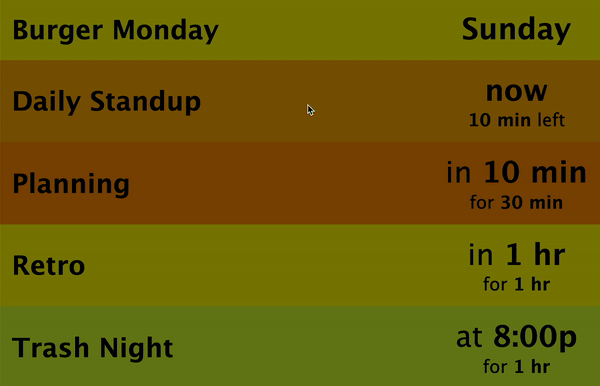
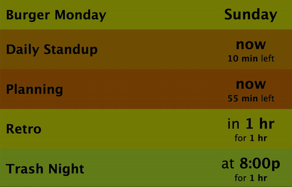

# statuscal

Statuscal is a simple calendar widget which is designed to be used with [statusboard](https://github.com/jwoglom/statusboard). 
It supports multiple calendars on multiple Google accounts across different people, all on one instance.

## Demo

Statuscal provides a touch-friendly user interface for quickly viewing your upcoming calendar items.
On a single statuscal "board", you can see multiple different calendars spanning multiple Google accounts.



To view more information on a calendar entry, you can just click it.
Otherwise, you just see the title of each calendar entry along with the time until the event begins, or time remaining in the event if it is in progress.

The color of each event is determined by the amount of time until it occurs.
This allows you to, at a glance, tell whether you have calendar events starting soon.



Events start green, when the start time of the event is more than 4 hours from now, and turn to red when the event's start time gets closer.
As the event progresses, it gets greener until the scheduled end time is reached.

## Setup

Clone the repository and install from requirements.txt or Pipfile:

```bash
pip install -r requirements.txt
  <or>
pipenv install
```

Follow the [Getting Started instructions for google-calendar-simple-api](https://google-calendar-simple-api.readthedocs.io/en/latest/getting_started.html) to configure Google Calendar API credentials.

* [Create a new Google Cloud Platform (GCP) project](https://developers.google.com/workspace/guides/create-project)
* [Enable the "Google Calendar API" for your project.](https://console.cloud.google.com/apis/api/calendar-json.googleapis.com/)
* [Configure the OAuth consent screen](https://developers.google.com/workspace/guides/create-credentials#oauth-client-id) and use the Web Application type. <s>Specify an authorized URI of `http://localhost:8080/` exactly, including the trailing slash.</s> Specify an authorized URI of _any top-level domain that you own on port 8080_: `https://yourdomain.com:8080`. You will specify this domain as the `AUTH_REDIRECT_URI` environment variable to statuscal.
* Download the credentials.json file


Once you have a `credentials.json` file, create a folder inside `credentials` to put it in, e.g.:

```bash
mkdir -p credentials/personal
mv ~/Downloads/credentials.json credentials/person_one_personal/
```

Now you can begin to configure your statuscal "boards".
A statuscal board represents all of the different calendars which will be displayed at a given URL.
This allows you to have multiple different "boards" which represent different people's calendars.

Assume that person_one wants to display three different calendars on their board at `http://statuscal_url/person_one`:

 * A primary calendar (on their personal Google account)
 * A shared calendar (on their personal Google account)
 * A work calendar (on their work Google account)

And that person_two wants to display a single calendar on their board at `http://statuscal_url/person_two`:

 * A primary calendar (on their personal Google account)

They could configure their board settings with the following configuration in `config.py`:

```python
boards = {
    # This is a statuscal board which is visible at /person_one, and displays
    # events from all of the given calendars:
    'person_one': [
        {
            # A calendar to be displayed on the board
            'calendar_name': 'My Calendar',
            # 'primary' references the default calendar for the user
            'calendar_id': 'primary',
            # The folder with credentials for a user account with access to this calendar.
            'credentials_path': 'credentials/person_one_personal',
        },
        {
            # A different calendar which the same user has access to
            'calendar_name': 'My Shared Calendar',
            # Either an email address or Calendar ID
            'calendar_id': 'calendar_id',
            'credentials_path': 'credentials/person_one_personal',
        },
        {
            # A different calendar with separate Google account credentials
            'calendar_name': 'My Work Calendar',
            'calendar_id': 'primary',
            'credentials_path': 'credentials/person_one_work',
        }
    ],
    # An entirely different statuscal board for a different person
    'person_two': [
        {
            'calendar_name': 'Person Two Calendar',
            'calendar_id': 'primary',
            'credentials_path': 'credentials/person_two',
        },
    ]
}
```

Now, simply start the Flask server:

```bash
FLASK_APP=app.py AUTH_REDIRECT_URI=https://yourdomain:8080 flask run
```

The very first time you run Statuscal, you will be prompted in the terminal to authorize with your Google account.
After opening the URL in your browser and accepting the OAuth request, you'll get an error screen due to the URL being invalid. **Copy-and-paste the query string (`?state=xxxx&code=yyyyy`) and run `curl 'http://localhost:8080/?<query_string>'`.**
After you authorize, a token.pickle file will be created in the credentials folder which won't require this to be done again.

In production, you can run the application with Gunicorn inside a virtualenv using a script such as the following:

```bash
source ./venv/bin/activate &&
exec gunicorn --pythonpath ./venv/lib/python3.8/site-packages --worker-class eventlet -w 1 app:app -b 127.0.0.1:8000 --log-level INFO --access-logfile -
```

## Troubleshooting
If you receive `Please delete credentials/foo/token.pickle and restart to re-authenticate with Google Calendar` (`google.auth.exceptions.RefreshError: ('invalid_grant: Bad Request', '{\n  "error": "invalid_grant",\n  "error_description": "Bad Request"\n}')`), then delete the `credentials/xxx/token.pickle` file and restart statuscal. In the stdout you'll see a link to authorize the credentials:

```
Please visit this URL to authorize this application: https://accounts.google.com/o/oauth2/auth?response_type=code&xxxxxx
```

Click it to authenticate with the correct Google account.

If you see the error

```
Error 400: invalid_request
Localhost URI is not allowed for 'NATIVE_DEVICE' client type.
```

Then follow these exact steps in Google Cloud's APIs and Services > Credentials to set up a credential with the correct client type:
* Create credentials -> OAuth client ID
* Application type: Web Application
* Authorized redirect URIs: <s>`http://localhost:8080/` (with trailing slash)</s> _any top-level domain that you own_. 
* Download the JSON and replace the `credentials.json` file inside the credentials/ folder.
* Set `AUTH_REDIRECT_URI=https://yourdomain.com` environment variable.

## Statusboard configuration
Statuscal works great when used as the primary widget for [statusboard](https://github.com/jwoglom/statusboard).
To configure, set the main iframe to the URL of statuscal in the `config.py` of statusboard.
(Depending on the size of your screen, you can also adjust the zoom URL parameter.)

```python
def custom_init_response(message):
    data = {}
    # ...
    data['main_iframe'] = {
        'name': 'statuscal',
        'url': 'http://statuscal_url/person_one?zoom=0.75',
        'scrolling': 'yes'
    }
    # ...
    return data
```